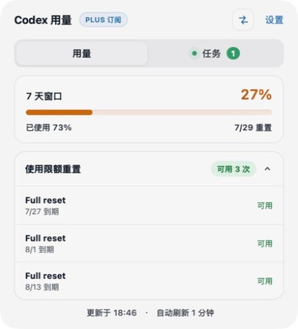
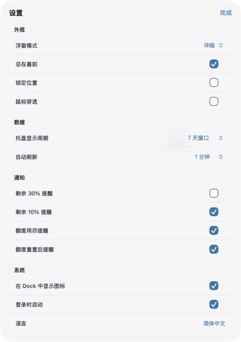

<p align="center">
  
</p>

<h1 align="center">Token Usage</h1>

<p align="center">Check your remaining Codex subscription quota from the Windows system tray, macOS menu bar, and a small desktop widget.</p>

<p align="center">
  <a href="https://github.com/EricZzzzz221b/token-usage/releases/latest"></a>
  
  <br>
  
</p>

<p align="center">
  <a href="https://github.com/EricZzzzz221b/token-usage/releases/latest"><strong>Download</strong></a>
  · <a href="CHANGELOG.md">Changelog</a>
  · <a href="README.md">中文</a>
</p>

Token Usage is a lightweight cross-platform utility that reads your local Codex sign-in, shows the remaining quota and reset time for the 5-hour and 7-day windows, and can notify you when quota is running low.

## Features

- Remaining quota shown as 100% when full and 0% when exhausted
- Choose the 5-hour or 7-day window in the menu bar
- Detailed and compact desktop widgets
- Manual refresh, configurable refresh interval, and quota alerts
- Always on top, position lock, click-through, and launch at login
- Automatic foreground contrast based on the desktop background
- Simplified Chinese and English interface

## Preview

<p align="center">
  
</p>

<p align="center">
  
</p>

<details>
  <summary>View settings</summary>
  <p align="center"></p>
</details>

## Download and install

| Platform                         | Status    | Version and download                                                                                                                                      |
| -------------------------------- | --------- | --------------------------------------------------------------------------------------------------------------------------------------------------------- |
| Windows 11 / Windows 10 22H2 x64 | Available | [MSI](outputs/TokenUsage_Windows_1.0.0_x64.msi) · [EXE](outputs/TokenUsage_Windows_1.0.0_x64-setup.exe) · [SHA-256](outputs/SHA256SUMS-Windows-1.0.0.txt) |
| macOS 13+ Apple Silicon          | Available | [v1.1.3 DMG](outputs/TokenUsage_1.1.3_arm64.dmg) · [Release notes](outputs/TokenUsage_1.1.3_ReleaseNotes.md)                                              |

The macOS build requires macOS 13 or later and a Codex client or CLI signed in with ChatGPT OAuth.

1. Download the latest `.dmg` from [Releases](https://github.com/EricZzzzz221b/token-usage/releases/latest).
2. Open the DMG and drag `Token用量.app` into `Applications`.
3. The current build is not Apple-notarized. On first launch, right-click the app in Finder, choose **Open**, and confirm once more.

Windows v1.0.0 currently supports x64 only. Prefer the MSI, or use the NSIS setup EXE. The installers are unsigned, so verify the published SHA-256 before using **More info → Run anyway** in SmartScreen. The embedded WebView2 bootstrapper starts Microsoft's installation flow if the runtime is missing. Uninstall from **Settings → Apps → Installed apps**. See the [Windows release notes](docs/release-notes-windows-v1.0.0.md) for details.

## Privacy

- OAuth credentials are read into local memory only and used solely for the official Codex usage endpoint.
- The app does not store, log, or upload access tokens, refresh tokens, email addresses, account IDs, or raw authentication data.
- Windows reads `%USERPROFILE%\.codex\auth.json` or `CODEX_HOME\auth.json`; it does not guess or read unverified Credential Manager formats.
- Settings and cache use Tauri system directories, including AppData on Windows.
- No telemetry or behavior tracking is included.

## Development

Node.js 22 and Rust stable are required. macOS also needs Xcode Command Line Tools; Windows needs Visual Studio 2022 Build Tools.

The app is built with Tauri 2, React, and TypeScript. Tauri is an open-source framework for building lightweight desktop apps with web technologies.

```bash
npm ci
npm run tauri:dev
```

Run all checks with:

```bash
npm run check
```

## Feedback

Bug reports and suggestions are welcome in [Issues](https://github.com/EricZzzzz221b/token-usage/issues).

This is a personal project and is not affiliated with OpenAI.
