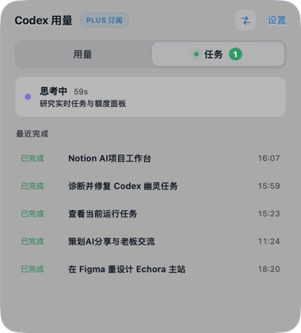

<p align="center">
  
</p>

<h1 align="center">Token Usage</h1>

<p align="center"><strong>Know how much quota is left and whether Codex is done—without switching back.</strong></p>

<p align="center">A Codex usage and task monitor for the Windows system tray and macOS menu bar.</p>

<p align="center">
  <a href="https://github.com/EricZzzzz221b/token-usage/releases/latest"></a>
  <a href="https://github.com/EricZzzzz221b/token-usage/releases/tag/v1.2.1"></a>
  <a href="https://github.com/EricZzzzz221b/token-usage/releases/tag/windows-v1.1.5"></a>
</p>

<p align="center">
  <a href="#download-and-install"><strong>Download</strong></a>
  · <a href="CHANGELOG.md">Changelog</a>
  · <a href="README.md">中文</a>
</p>

Token Usage puts the two Codex details you check most often into one small widget: **how much quota remains, and whether your current tasks are still running**. Keep working in your browser, editor, or design tool while the menu bar shows whether Codex is thinking, executing a tool, or waiting for input. When a task finishes, the app can notify you and open the matching Codex conversation from the recent list.

The app detects whether the official account is using a subscription or API mode. Subscription accounts show plan information and usage windows; API mode shows Credits when the official response provides them. Credentials, usage data, and task detection stay on your Mac or PC.

## What it helps you do

### Leave Codex without losing track of work

- See every active task separately instead of one merged status
- Distinguish thinking, executing, waiting, completed, failed, and interrupted states
- See task status, elapsed time, active task count, and remaining quota in the menu bar
- Open the matching Codex conversation from an active task or any of the five recent completions
- Receive a local notification when a task finishes

### Plan around quota with less guesswork

- Read quota as 100% when full and 0% when exhausted
- Track the 5-hour, 7-day, and other windows returned by the official service
- See the 7-day reset as a calendar date
- See available usage-limit reset opportunities and their expiry information
- Configure low-quota, exhausted-quota, and quota-restored notifications

### Stay available without taking over the desktop

- Use detailed mode for quota, tasks, and recent completions
- Use compact mode for only the current task, elapsed time, and quota
- Keep the widget on top, lock its position, enable click-through, or launch it at login
- Choose whether the macOS app appears in the Dock
- Choose the 5-hour or 7-day value shown in the tray or menu bar

## Features

- Remaining quota shown as 100% when full and 0% when exhausted
- Automatic subscription/API mode detection; Credits are shown only in API mode when available
- Usage-limit reset opportunities with a collapsed-by-default details section
- Choose the 5-hour or 7-day window in the system tray or menu bar
- Detailed and compact widgets with quick switching from the widget or tray
- Manual refresh, configurable refresh interval, and quota alerts
- Live local Codex task detection, elapsed time, five recent completions, and completion notifications
- One-click navigation from active and recently completed tasks to their Codex conversations
- Multiple active tasks displayed separately
- Always on top, position lock, click-through, and launch at login
- Windows 11 Mica, Windows 10 Acrylic, and a readable solid-color fallback
- Automatic light/dark contrast and basic Windows high-contrast support
- Simplified Chinese and English interface

## Preview

<table align="center">
  <tr>
    <td align="center"><br><sub>Quota, reset date, and reset opportunities</sub></td>
    <td align="center"><br><sub>Active tasks and recent completions</sub></td>
  </tr>
</table>

<p align="center">
  
</p>

<details>
  <summary>View settings</summary>
  <p align="center"></p>
</details>

## Download and install

| Platform                         | Status    | Version and download                                                                                                                                                                                                                                                                                                                                                                                                                                             |
| -------------------------------- | --------- | ---------------------------------------------------------------------------------------------------------------------------------------------------------------------------------------------------------------------------------------------------------------------------------------------------------------------------------------------------------------------------------------------------------------------------------------------------------------- |
| macOS 13+ Apple Silicon          | Available | [v1.2.1](https://github.com/EricZzzzz221b/token-usage/releases/tag/v1.2.1) · [DMG](https://github.com/EricZzzzz221b/token-usage/releases/download/v1.2.1/TokenUsage_1.2.1_arm64.dmg) · [SHA-256](https://github.com/EricZzzzz221b/token-usage/releases/download/v1.2.1/SHA256SUMS-1.2.1.txt)                                                                                                                                                                     |
| Windows 11 / Windows 10 22H2 x64 | Available | [v1.1.5](https://github.com/EricZzzzz221b/token-usage/releases/tag/windows-v1.1.5) · [MSI](https://github.com/EricZzzzz221b/token-usage/releases/download/windows-v1.1.5/TokenUsage_Windows_1.1.5_x64.msi) · [EXE](https://github.com/EricZzzzz221b/token-usage/releases/download/windows-v1.1.5/TokenUsage_Windows_1.1.5_x64-setup.exe) · [SHA-256](https://github.com/EricZzzzz221b/token-usage/releases/download/windows-v1.1.5/SHA256SUMS-Windows-1.1.5.txt) |

### macOS v1.2.1

Download the [DMG](https://github.com/EricZzzzz221b/token-usage/releases/download/v1.2.1/TokenUsage_1.2.1_arm64.dmg), open it, and drag `Token用量.app` into `Applications`. v1.2.1 adds active-task conversation shortcuts and fixes transient recent-completion loss, reset-opportunity gaps, and disclosure-chevron movement. The build is ad-hoc signed and not Apple-notarized; on first launch, right-click the app in Finder, choose **Open**, and confirm once more.

### Windows v1.1.5

The Windows release supports x64 only. Prefer the MSI, or use the NSIS setup EXE. The installers are unsigned, so verify the published SHA-256 before using **More info → Run anyway** in SmartScreen. The embedded WebView2 bootstrapper starts Microsoft's installation flow if the runtime is missing. Uninstall from **Settings → Apps → Installed apps**. See the [Windows v1.1.5 Release](https://github.com/EricZzzzz221b/token-usage/releases/tag/windows-v1.1.5) for details.

## Privacy

- OAuth credentials are read into local memory only and used solely for the official Codex usage endpoint.
- Task status incrementally reads local Codex lifecycle events; full prompts, responses, command output, and file contents are not uploaded or copied into app storage.
- The app does not store, log, or upload access tokens, refresh tokens, email addresses, account IDs, or raw authentication data.
- Windows reads `%USERPROFILE%\.codex\auth.json` or `CODEX_HOME\auth.json`; it does not guess or read unverified Credential Manager formats.
- Settings and cache use Tauri system directories, including AppData on Windows.
- No telemetry or behavior tracking is included.

## Development

Node.js 22 and Rust stable are required. macOS also needs Xcode Command Line Tools; Windows needs Visual Studio 2022 Build Tools.

The app is built with Tauri 2, React, and TypeScript. Tauri is an open-source framework for building lightweight desktop apps with web technologies.

```bash
npm ci
npm run tauri:dev
```

Run all checks with:

```bash
npm run check
```

## Feedback

Bug reports and suggestions are welcome in [Issues](https://github.com/EricZzzzz221b/token-usage/issues).

This is a personal project and is not affiliated with OpenAI.
